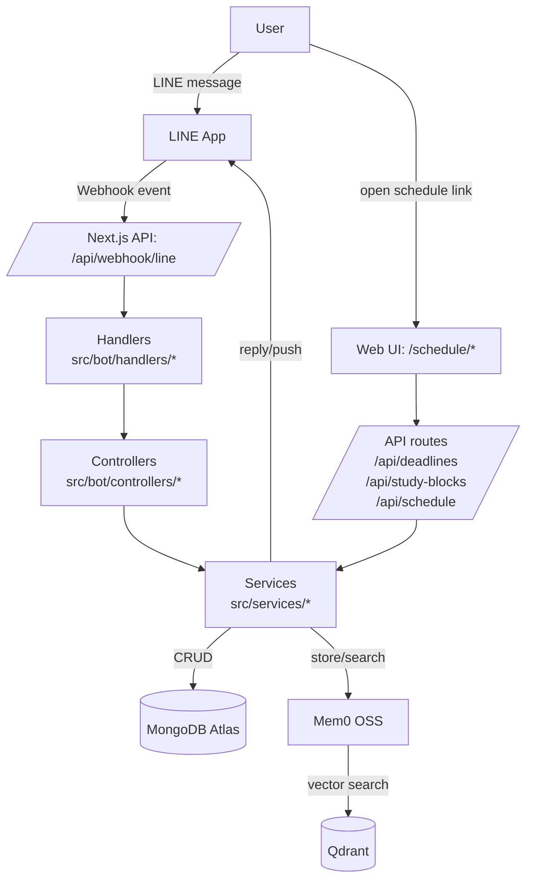
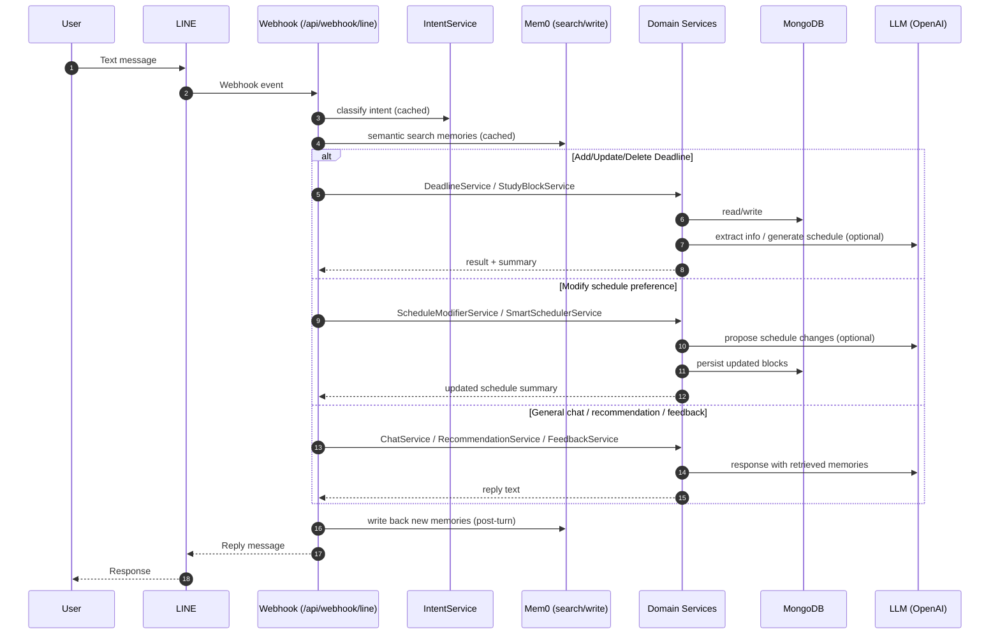

# Coby

LINE 上的智慧時間管理助理：以自然語言維護 Deadlines 與學習區塊，並提供可視化時程頁面。對話層結合 **意圖分類** 與 **Mem0（Qdrant 向量儲存）** 的長期記憶，用於個人化回覆與建議。

**LINE Official Account：** `@445kyihz`

## 目前做到的事情

- 自然語言新增、修改、刪除 Deadline，以及調整排程偏好（時段、排除日期等）。
- 依截止日自動產生學習區塊；Web 端 `/schedule` 支援拖曳編排。
- 簽到、每日內容、待辦摘要等互動流程。
- Mem0 語意檢索與寫入，搭配 MongoDB 持久化使用者資料與對話紀錄。

## 技術棧

Next.js 14（App Router）、TypeScript、Tailwind CSS；OpenAI SDK；MongoDB（Mongoose）；Mem0 OSS 與 Qdrant；Zod；時程 UI 使用 react-beautiful-dnd。

## 架構

單一 Next.js 應用承載 LINE Webhook、REST API 與前端頁面。請求由 `src/bot/handlers` 進入、`controllers` 編排、`services` 執行業務邏輯；結構化資料寫入 MongoDB，長期記憶經 Mem0 讀寫 Qdrant。

## 訊息處理流程

## Mem0 與資料

寫入：回合結束後將可沿用的事實寫入 Mem0，並在 MongoDB 保留原始紀錄。檢索：新訊息先語意搜尋相關記憶再注入 system prompt。應用包含簽到回饋（`FeedbackService`）、建議（`RecommendationService`）及排程相關 LLM 流程。

## 服務層（`src/services`）

- **LLM / Intent：** `IntentService`、`ChatService`、`PreferenceExtractorService`、`SchedulerLLMService`、`ScheduleModifierService`
- **Scheduling：** `SmartSchedulerService`、`ScheduleValidatorService`（含 LLM 結果驗證與規則備援）
- **Deadline / StudyBlock：** `DeadlineService`、`DeadlineRescheduleService`、`DeadlineMatcherService`、`StudyBlockService`
- **User / Session：** `UserStateService`、`UserTokenService`、`UserDeletionService`
- **Engagement：** `CheckinService`、`QuoteService`、`FeedbackService`、`RecommendationService`

## 快取

`src/lib/utils/ttl-cache.ts` 提供 in-memory TTL：Mem0 搜尋、意圖分類、日期解析，以降低重複呼叫 LLM 與向量服務。

## 組態

環境變數範例見 `.env.example`。部署官方帳號時，LINE Webhook 應設為 `https://<你的網域>/api/webhook/line`。

## 執行方法

- **本機 Node**：日常開發、hot reload、除錯。
- **Docker Compose**：和 production build 一致；一併啟動 Qdrant 與應用。

### 本機

- 安裝依賴：`npm install`
- 設定`.env`
- 啟動開發伺服器：`npm run dev`（預設 `http://localhost:3000`）
- Mem0 / Qdran：
  - 託管 Qdrant：於 `.env.local` 設定 `QDRANT_URL`（和 `QDRANT_API_KEY`）
  - 本機僅起向量庫：`docker compose up -d qdrant`，並將 `memory.config` 所讀變數指向 `localhost:6333`

### Docker（Compose）

- 於專案根目錄建立 `.env`
- 建置並啟動：`docker compose up --build`
- 應用：`http://localhost:3000`
- Qdrant：`http://localhost:6333`
- Compose 內 Mem0 使用服務網路中的 Qdrant；`mem0_history.db` 以 volume 持久化

## 相關文件

- `docs/DEVELOPMENT.md`：目錄與事件流
- `docs/data-schema.md`：資料模型與時間策略（UTC 儲存、Asia/Taipei 顯示）

