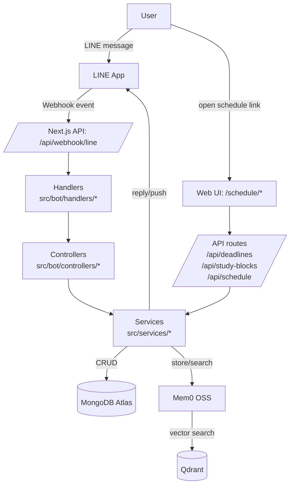
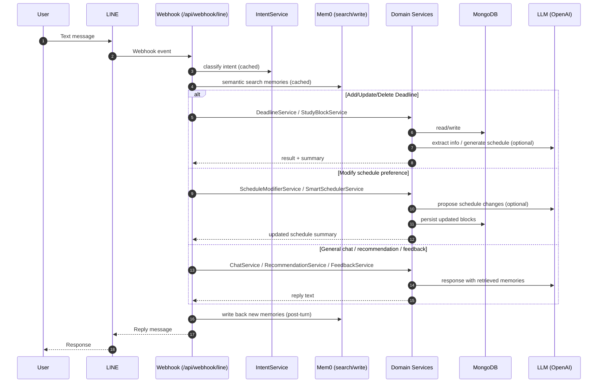

# Coby

整合 LINE Messaging API 的智慧時間管理助手：用自然語言新增/修改 Deadlines，自動生成可視化學習時程表，並透過 **Mem0 長期記憶**與 **意圖分類（Intent Classification）**提供個人化對話與建議。

> **LINE ID ：@445kyihz**

## 主要功能

- **自然語言操作**：新增/修改/刪除 Deadline、修改排程偏好（例如排除日期/偏好時段）。
- **自動排程**：依截止日回推安排讀書區塊，並提供拖曳調整的時程表頁面。
- **每日互動**：簽到、占卜、今日待辦/提醒摘要。
- **個人化回應**：透過 Mem0 記住使用者偏好與歷史互動，讓建議更貼近個人習慣。

## 技術棧

- **Runtime / Web**：Next.js 14 (App Router) + TypeScript + Tailwind CSS
- **LLM**：OpenAI SDK（模型可由環境變數切換）
- **DB**：MongoDB Atlas + Mongoose
- **Long-term Memory**：Mem0 OSS + Qdrant（向量檢索）
- **Validation**：Zod
- **Scheduling UI**：react-beautiful-dnd

## 系統架構




```
LINE Webhook (/api/webhook/line)
  → event handlers (src/bot/handlers/*)
  → controllers (src/bot/controllers/*)
  → services (src/services/*)
      ├─ MongoDB (deadlines, study blocks, user state, saved items)
      └─ Mem0 + Qdrant (semantic memory: store + search)
  → LINE reply / push message

Web UI (/schedule/*)
  → Next.js pages + API routes (/api/deadlines, /api/study-blocks, /api/schedule)
```

## 訊息處理流程（Intent + Memory + Scheduling）




## Mem0 記憶流程

- **寫入**：對話結束後，將可復用的使用者資訊抽取/整理後寫入 Mem0；同時在 MongoDB 保留原始紀錄（SavedItem）。
- **檢索**：收到新訊息時，先用語意檢索找出相關記憶，注入系統提示詞（system prompt），提升連貫性與個人化。
- **應用場景**：簽到回饋（`FeedbackService`）、學習建議（`RecommendationService`）、排程偏好理解（LLM services）。

## 服務分工

> 位置：`src/services/`*（Bot controller 會組裝回應並呼叫這些 service）

- **LLM / Intent**
  - `IntentService`：意圖分類（如 check-in / view-schedule / add-deadline / modify-schedule）。
  - `ChatService`：一般對話回覆（含記憶注入與回覆生成）。
  - `PreferenceExtractorService`：從自然語句萃取偏好（時段、排除規則等）。
  - `SchedulerLLMService` / `ScheduleModifierService`：用 LLM 產生/修改排程草案。
- **Scheduling**
  - `SmartSchedulerService`：排程核心，整合限制與偏好。
  - `ScheduleValidatorService`：驗證 LLM 排程結果；失敗時走備援策略（rule-based/fallback）。
- **Deadline / Study Blocks**
  - `DeadlineService`：CRUD + 觸發重新排程。
  - `DeadlineRescheduleService` / `DeadlineMatcherService`：期限變更或語意指涉的處理。
  - `StudyBlockService`：讀書區塊 CRUD、關聯 deadline、狀態更新。
- **User / Session**
  - `UserStateService`：多步驟流程狀態（引導式新增 deadline、取消/回主選單等）。
  - `UserTokenService`：產生/驗證 schedule 頁面存取 token。
  - `UserDeletionService`：解除關注或清除資料時的刪除流程。
- **Engagement**
  - `CheckinService`：簽到、連續天數、今日摘要。
  - `QuoteService`：占卜/每日內容生成。
  - `FeedbackService`：結合記憶生成個人化回饋。
  - `RecommendationService`：結合記憶給讀書/排程建議。

## 快取使用 in-memory TTL cache：`src/lib/utils/ttl-cache.ts`

- **Mem0 搜尋結果快取**：避免同一使用者同一 query 重複打 Qdrant
- **Intent 分類快取**：避免同一句話重跑意圖分類
- **日期解析快取**：避免同一句話重跑時間解析

## 本地啟動

### 1) 安裝

```bash
npm install
```

### 2) 環境變數

建立 `.env.local`（範例見 `.env.example`），至少需：

- `LINE_CHANNEL_SECRET`
- `LINE_CHANNEL_ACCESS_TOKEN`
- `OPENAI_API_KEY`（與選用的 `OPENAI_MODEL`）
- `MONGODB_URI`
- `MEMORY_PROVIDER`（例如 `mem0_oss`）
- `QDRANT_URL` / `QDRANT_API_KEY`（或用下方 compose 起本機 Qdrant）
- `NEXT_PUBLIC_APP_URL`

### 3) （可選）啟動本機 Qdrant

```bash
docker compose up -d
```

### 4) 啟動開發伺服器

```bash
npm run dev
```

## 文件

- `docs/DEVELOPMENT.md`：開發者導覽（handlers/controllers/services 分層）
- `docs/data-schema.md`：資料 schema 與時間策略（UTC 儲存、台灣時區顯示）

